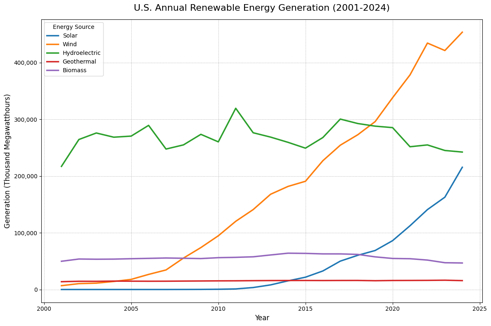

# U.S. Renewable Energy Generation Analysis & Visualization

### A Python project to analyze and visualize the growth of renewable energy in the United States.

---

## Project Description
This project includes a Python script that programmatically fetches annual electricity generation data from the U.S. Energy Information Administration (EIA) API. It then processes and cleans the data using the Pandas library and creates a time-series chart with Matplotlib to visualize the rapid growth of solar and wind power over the past two decades.

## Key Features
- **Automated Data Fetching:** Interacts with the live EIA v2 API to get up-to-date energy data.
- **Data Cleaning & Processing:** Uses Pandas to structure the raw JSON response into a clean, usable table (DataFrame), handling missing values along the way.
- **Data Visualization:** Creates a clear and informative line chart using Matplotlib to display trends over time.

## Final Visualization
Here is the final output chart showing the generation trends for key renewable energy sources.

## How to Run
1. Clone the repository.
2. Install the required libraries: `pip install pandas requests matplotlib`.
3. Obtain a free API key from the [EIA website](https://www.eia.gov/opendata/register.php).
4. Replace the `YOUR_API_KEY_HERE` placeholder in `analysis.py` with your personal key.
5. Run the script: `python analysis.py`.
